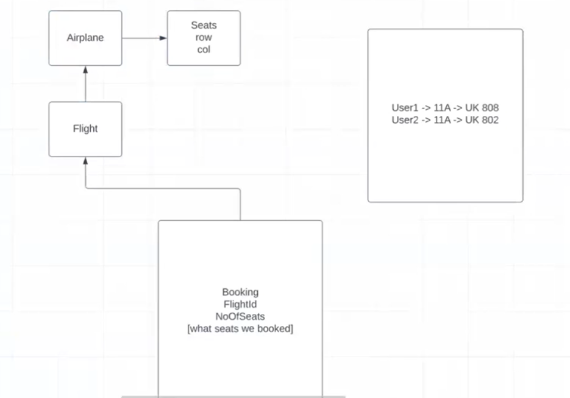

We cloned the Base Node Project Template, defined the database and executed `npx sequelize db:create` to create the Flights database.

We then defined the Airplane model (schema) using `npx sequelize model:generate`. Executing this command does two things: it creates the model and a migration file.

The table isn't actually created at this point, we need to use migrations for what. Migrations act like a version control (Git), so after using `npx sequelize model:generate`, we get a migrations file, which tells us what all changes will be done in the next migration. If we want to make any changes, this is the right point before we create the table.

Real life usecase for migrations:

Let's say there are five developers in the team. Developer A makes some change in the schema, commits those changes and pushes it to the repo. Now the other four developers can do a git pull, run the migration and they too will now have the latest schema.

There can be two levels of constraints: JavaScript level constraints (that we specify in the models), and database level constraints (that we specify in the migrations) -> it might look like models is not being used, but it is being used by the Sequelize for application level constraints

When we execute `npx sequelize db:migrate`, it executes all the pending migrations (more specifically, the up() function of the migrations). Now the question might be, that how does Sequelize know which migrations are pending, and which are not? Sequelize keeps a track of all the migrations run so far, as each migration has a unique ID based on the date and time, it was created.

When we execute `npx sequelize db:migrate:undo`, it does undo of the last migration (specifically, it executes the down() function of the migration). 

Q. Are both JavaScript level constraints and database level constraints required?

A. If the records are inserted through the JavaScript application, then both the JavaScript level constraints as well as database level constraints will be enforced. However, if the records are inserted directly (for example, through the CLI), then only database level constraints will be enforced.

There's something called as `sync()` in Sequelize ORM, with the help of which we can sync our tables to have the latest possible schema at any point of time.

Q. What does `body-parser` or `app.use(express.json())` do? Why is it required, what happens if I don't use it ?

A. If we send the request body as JSON, express won't be able to decode the JSON and our API won't work. Hence we need `body-parser` or `app.use(express.json())` to decode the incoming JSON, so that Express can parse it. In earlier days, a separate package called the `body-parser` was used, these days they have integrated it in `express` as well.

Q. What is `app.use(express.urlencoded())` ? Why is it required, what happens if I don't use it ?

A. First things first, we need to know about URL encoding.

What is URL encoding? URL encoding is converting the characters into a format that can be transmitted over the Internet. Example: space is encoded as "%20", inverted comma as "%22". See W3 Schools for more information.

`Express` library can't parse the URL encoded strings as such. So we need to specify `express.urlencoded()` in order to parse the URL encoded strings.

There's a minor point about using "extended:true" in url-encoded, it indicates what library we want to use. The extended option allows to choose between parsing the URL-encoded data with the querystring library (when false) or the qs library (when true).

Q. Why are we creating error classes in the project? 

A. We need to have a consistent manner of error handling in the project. If we don't define error classes, then different developers will throw different types of errors, and it will lead to inconsistency.

We are also reducing the duplication of code by making a common Response class, as every time we are sending message, error, status and data in the response. 

There's also a minor improvement that we can do in the project: Avoid using hard strings, for two reasons:

1. Maintainability and preventing code duplication

2. Internationalisation: In highly scalable applications, the responses may have to be sent according to the region where the request is coming from.

**Project Design: What is the Project about?**

We are seeking to build something like Google Flights, which shows the flights from a destination to source. Now based upon the different options, we can see the prices of flights, the number of available seats, Airplane model etc. We will also simulate booking of a ticket, sending confirmation mail to the passenger through email, send reminders etc

We are going to use a microservices architecture, and there's a reason for that. The entire flight search and booking system is something that is read intensive, rather than being write intensive (because more people tend to search for a flight rather than actually booking it). So, if we keep the project as a monolith, we'll have to scale both the Flight Search Service and Booking Service during peak season like New Year. However, if we keep both of them as separate services then we can work on scaling the Search Service only.

In order to use the seeders, we use `npx sequelize seed:generate --name add-airplanes`. This will give us a file in the seeder folder, which we can change to allow bulk insertion and bulk deletion of records.

Once the seeder is defined, we can execute `npx sequelize db:seed:all`

Let's also resolve a confusion: Bulk insert doesn't mean that multiple copies of a single record will be stored in the database, it means that many different records (specified by the developer) will all be inserted into the database at once. (Compared to the traditional way of inserting each record one by one)

The benefit of using seeder is that it is easier for a developer to run the seed, and the dummy records will be inserted, compared to inserting each record individually by sending API requests/ using raw SQL queries.

To undo the seed, we can execute `npx sequelize db:seed:undo:all`. In this case, the down() method of the seeder will be executed.

In order to setup the association between the Cities and Airport Model, we use `npx sequelize migration:generate --name update-city-airport-association`. We add the foreign key constraint, both at the database level (migrations) and JavaScript level (models). 

While implementing the CRUD APIs for Flight, we need to be little careful: because the API to create or delete a flight shouldn't be exposed to the end user, they should only be exposed to the admin. We'll be taking care of this later in the authentication and authorization part. Also, the read APIs would be based upon some filter conditions like destination Airport, source Airport etc.

Using an ORM can help us write complex SQL queries in an object oriented fashion which is quite readable, but ORM comes with its own disadvantage which is that it might prepare slow queries for operations which can be done simply.

The flow in which the seats would be booked is given as: 