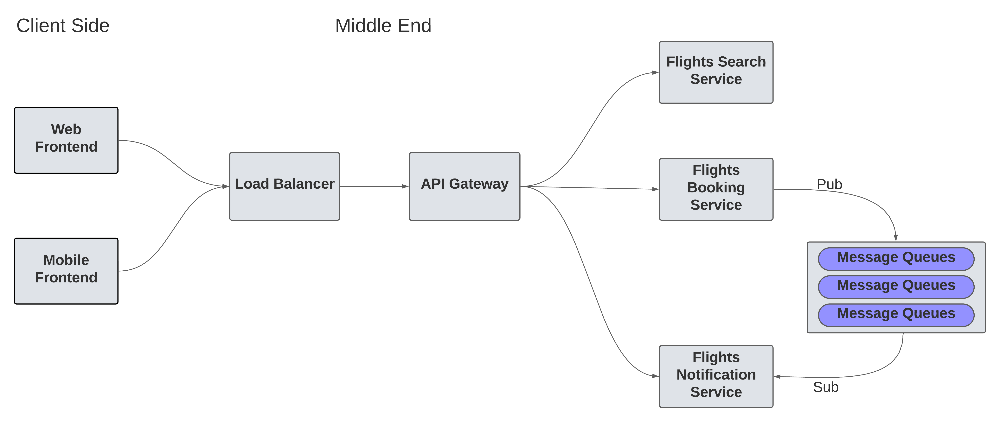
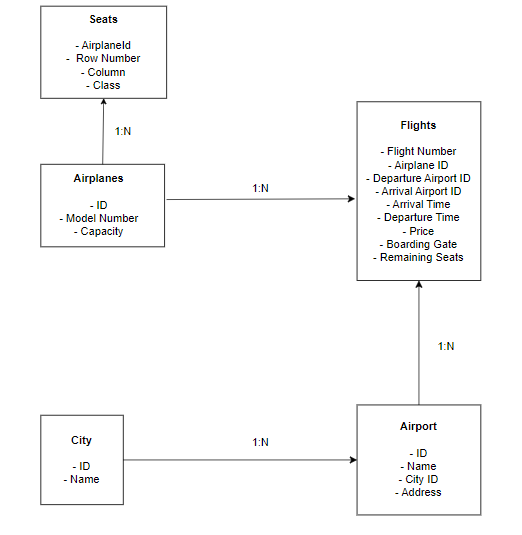
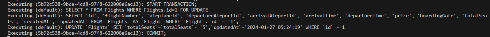

# Flights Search Service

<h3>Objective</h3>

    We need to build a backend system that can support different features for an airline company, our end user is going to be someone who wants to book flights and query about flights so we need a robust system to actually help them give the best experience possible. This doc is solely going to focus on the backend part of the system. We want to prepare the whole backend keeping the fact that the code base should be as maintainable as possible.

<h3>High Level Design of the Project</h3>

<h3>Schema of the Flights Search Service</h3>

**For the demo video of this project, please** <a href="https://youtu.be/SNveezpZLsc" target="_blank" > click here </a>

<h3>Services in the Project</h3>
<ul>
<li>
<h4>
<a href="https://github.com/girikgarg8/Flights-API-Gateway" target="_blank">Flights API Gateway</a></h4>
</li>
<li>
<h4>
<a href="https://github.com/girikgarg8/Flights-Booking-Service" target="_blank">Flights Booking Service</a></h4>
</li>
<li>
<h4>
<a href="https://github.com/girikgarg8/Flights-Notification-Service" target="_blank">Flights Notification Service</a></h4>
</li>
</ul>

**High level flow of the service** 

We started by identifying the functional and non-functional requirements of the project. We then designed the schema and identified the models: Airplane, City, Airport, Flight and Seats. We then setup these models and created CRUD APIs for each of these models.

The attribute city_id in Airport is the foreign key which references the primary key id of City. There is a one to many relationship between these models (one city can have multiple airports) . So, we set up an association between these models by establishing the foreign key relationship using Sequelize ORM.

Similarly, we identified a one to many relationship between Airport and Flight (one airport can have many flights departing/arriving), and a similar one to many relationship between Airplane and Flight (one airplane can be used for many flights). Hence we setup the foreign key constraints at both the JavaScript and database levels.

The GET API for Flights was setup in a manner to search flights based upon different filters like departure airport, arrival airport, minimum and maximum price, trip date, number of seats required etc. We also extended the functionality to sort the results based upon different parameters like arrival time, departure time, price etc. We took motivation from Flipkart Flights for the design of the Flights API.

We used inner joins (through a functionality called eager loading in Sequelize ORM) to find out the airport name corresponding to an airport ID and return it in the response of GET '/flights' API. There was a challenge while using joins between the `Flights` and `Airports` models, as we need to have custom joins (because these entities are related to each other with the help of `departureAirportId` and `arrivalAirportId`)

We have impelemented a row level lock on the flights table, to prevent two concurrent requests from writing into the same set of rows. We also implemented transactional capabilities in some of the functions where concurrent requests are possible, this ensures the atomicity of the transaction.

Below is a snapshot depicting the transactional capabilities of the Search Service:

For the complete design doc of this project please <a href="https://docs.google.com/document/d/1FyH16wreiVJ3Vtazm8msDB7-DPQsjRFSYDkLdWSvdJo/edit?usp=sharing" target="_blank"> click here
