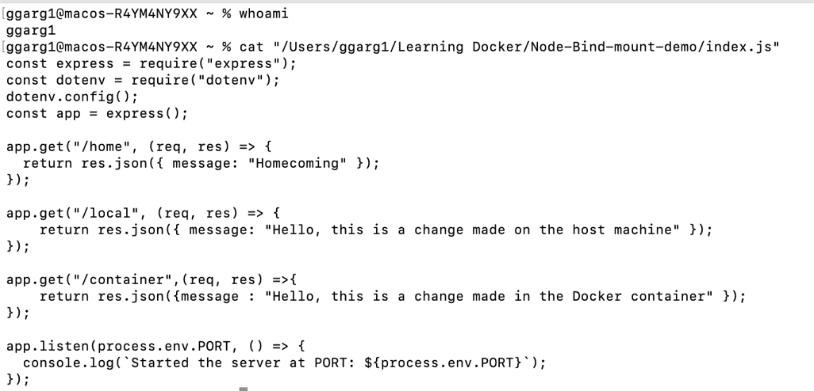
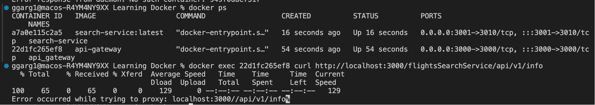

## Introduction to containers ##

Let's go back a little bit back in time to understand.

In earlier days, all applications used to be hosted on dedicated machines. As an example, schools and colleges used to host their applications on dedicated machines. The problem with this approach is that it is not scalable, so if we need to scale up or scale down the application, it is going to be a problem.

So cloud providers like AWS, Azure and GCP came into picture. They offer machines to rent which are hosted in their data centres. But there's still a problem, that different clients may be using the resources on the same machine, and we need to ensure that there's isolation between them so that the sensitive information from one container is not leaked to other guy. Also, we need to protect the cloud instance from a single point of failure and SQL injection attacks etc. 

This is where containers help us. Containers are isolated from each other, and do not allow inter container communication, unless we configure them to have inter container communication. 

**What is the difference between docker image and container?**

Docker image: It is a snapshot or a blueprint of the complete environment for an application. It includes everything like what the application needs to run such as libraries, dependencies, configuration etc. It kind of encapsulates the application and all the requirements together. 

These docker images can be created with the help of Dockerfile. Or we can get some prebuilt images from Dockerhub - Dockerhub is the hub of "Docker images". 

Docker containers: A container is an actual instance of the environment configured by the image. When we run a docker image, it creates a live and running container. These containers are isolated from each other and act as a light weight Virtual Machine. 

We can understand the difference between the Docker image and Docker container by the analogy of process (Docker container) and program (Docker image), or the analogy between a class (Docker image) and object. (Docker container)

A big difference between Virtual Machines and containers is that containers share the host OS kernel, hence they are light weight in nature. 

**How docker is used in company projects?**

Let's say there are three different people working in a team, and each one of them has different OS on their laptop (say Ubuntu, Windows and Arch). Now if all of them setup the project on their local, it can lead to compatibility issues because the libraries have different versions on different machines. So, as a solution what we can do is, to clone the project in a Ubuntu container. Now, it doesn't matter what the host OS is, all the team members will be able to work on the project without any problems. A good point also is the fact that this container is going to be isolated from the host OS, as well as other containers.

Diagrammatic representation:


We can explore the pre-existing docker images from Dockerhub, like those of Node, Ubuntu, Python etc

Let's execute `docker pull node`. This command is going to pull the Docker image from Dockerhub (similar to how we pull a branch from Github)

`Docker pull` command output:


Friendly advice: If there are lots of images on the system, periodically clear them because they take up a lot of space.

In order to execute the image in the container, we use `docker run <image name>` (similar to how we run a program)

We'll also use two options: `-it` in order to start the container in interactive mode (which allows the user on the host OS to interact with the container). If this flag is not used, the container will start and exit, because it doesn't have any command to execute. By using the interactive mode, we are asking the container to wait for the user input.

`--rm` option helps delete the container after it exits. This helps us to save space on the disk.

As an example,

Output of running `docker run --it --rm node` :


We can execeute a command in docker interactive mode by specifying it, like as an example


How Docker Desktop shows the running containers:


How to list the running docker containers: Use `docker ps` (Similar to how `ps` in Ubuntu shows all the running processes in the OS), see example below:


Docker PS lists the container ID, image which the container is running, a unique name of the container, creation time of the container etc.

In order to kill the container, we use `docker kill <container ID>` (similar to how we kill a process in OS). Here's the demonstration of the same:


Dangling images in Docker are the images which do not have a tag associated to them. This can happend if a new build of a image is built, so the previous builds become dangling in nature.

See this hyperlink for more information : [Dangling image in Docker](https://www.howtogeek.com/devops/what-are-dangling-docker-images/)

If we want to run a docker image in the background as a daemon process, we can use the `detach` flag.  If at a later stage, we want to run the docker container as a foreground process, we can do so by using the `attach` flag. See the screenshot below:


We can give a custom name to the container (instead of using the default one, which is assigned by Docker), by using the `--name` flag. As an example:


If we are using any image (like that of node or python, as an example), it must be running on same base image (like Ubuntu). So, we can use the bash shell anytime while running a container with these images.


Let's talk about tags in Docker: Tags in Docker point to specific versions of the Docker image. (Just like tags in Git point to certain commits in the commit history)

How to inspect Docker images? Use `docker inspect <container name>`, see example below:


A container can be paused and unpaused in Docker, see example below:


Let's talk about the `docker exec` command. This command is used to execute a command inside the docker container. The syntax for this command is `docker exec <container ID> <command>.` See the example below:


Q. What's the difference between `docker run <command>` and `docker exec <command>` ? 

A. `Docker run <command>` spins up a new container and executes the command. Whereas `docker exec <command>` is used to execute the command on an already existing container. 

Let's learn how to create a new Docker image using a Dockerfile. 

Consider the Dockerfile below:

```
FROM node

CMD ["node","-e","console.log(100)"]
```

Here, we are specifying node as the base image and the node command to print 100. Here's how to build the image :


We can also specify a custom name to the image after building from the container, using the `-t` flag. Here's how:


**Let's now try to create a local project and dockerize it**

We'll be creating a node server application and running it on Docker container. 

```
FROM node

WORKDIR /developer/nodejs/my-server

COPY . .

RUN npm ci

CMD ["node","index.js"]
```

In this DockerFile, we are specifying the work directory as `/developer/nodejs/my-server` inside the docker container, if this directory doesn't exist, docker will create this directory inside the container. We are copying all the contents from present working directory in host machine to the `my-server` directory in the container. We are then specifying the command to do a `clean install` using npm (Clean install doesn't use node modules cache, compared to the `npm install`). Thereafter we are running `node index.js` in order to start the server.

Let's now build this docker image and see the results:


There are some problems that we still need to solve: 

1. The express server has started only inside the Docker container, and no port is exposed to the host OS. So, the host OS won't be able to send request to the express server.

2. The host OS won't be able to interact in any way with the container. As an example, if we try to kill the server from the host OS, we wouldn't be able to do that. 

So, in order to solve these problems, we have the following solutions:

1. In order to solve the first problem listed above, we will expose a port from the container to the host OS using the `publish` or the `p` option. See example below:


2. In order to solve the second problem listed above, we will use the `init` option. This option allows the docker container to receive commands from the host OS. See example below:


**Let's now try to dockerize a project from Github and setup the environment variables**

For the purpose of this demonstration, we will be cloning this repository [Github Link](https://github.com/girikgarg8/Dockerizing-Node-Project) in the Docker container. The dockerfile can be found in the [Node_From_Github](./Node_From_Github/) directory.

This is the output of building the Docker image from the Dockerfile and running the Docker container:


Few important point to note:

1. In the `publish` option, the first port is that of the host machine, and the second port is that of the container. Example: `docker run --publish 3001:3000 app-from-github` is going to expose the port 3000 of the container to port 3001 of the host machine.

2. Difference between RUN and CMD : RUN is used to execute commands during the build process of a Docker image, while CMD is used to specify the default command to run when a Docker container is started from the image.

How to configure the environment variables in the docker container?

We can specify the environment variables by specifying the `ENV` in the Dockerfile, and the required environment variables will appear in the Docker container, see the screenshot below:


Let's now see how we can dockerize a Flask project: Explore this Github Repository: [Link to Flask App Repository](https://github.com/girikgarg8/Dockerizing-Flask-App)


Let's learn about `EXPOSE` in Docker:

`EXPOSE` in Docker is similar to `publish` option, and allows user to specify in the Dockerfile, which port of the container they want to expose. However, the mapping of the container's port to the host OS's container is random, so we don't get to choose the host OS's port (unlike the publish option). We need to specify the `-P` flag, something like the command `docker run -it --rm -P app-from-github .`

See the screenshots below:


As we can see from the screenshot above, the port 3000 of the container is mapped to the port 55000 of the host OS. So, the node application running on port 3000 of container is available on port 55000 of the host machine.


In order to remove all the images,containers etc, use `docker system prune -a`.

## Let's understand the usecase of bind mount in Docker: ##

Supppose that I make any change in the local project on my host machine, those changes won't reflect in the docker container's project. But if I have a usecase where we want that any changes made on the local machine should reflect in the Docker container as well, then we can use the bind mount. Bind mount enables a two way mapping between the Docker container and the host machine, meaning that any changes made in the host machine will reflect in the Docker container and vice versa.

In order to use the bind mount, we have to specify a mapping between the directory in the host machine and the directory in the Docker container using the `-v` option. As an example, see the syntax: `docker run -it --init -p 3002:3000 -v "$(pwd)":/developer/nodejs/node-bind-mount-project app-bind-mount-node:latest`

See the screenshots below:

Node Server restarting in the docker container :


Inspecting the contents of the node project in the Docker container, where we can see the changes made on the host machine :


Sending a curl to the new endpoint in the Docker container :


Changes from the Docker container reflecting in the host machine :



## Let's understand about Docker volume ##

Docker volumes are used to persist the data of the Docker container, even after the container is shut down or exited. This can also be used to share the data of one container with other containers.

Let's  understand a usecase when data persistance can be necessary: Consider the Node Project for [API Gateway](./API-Gateway/) , which is an API Gateway cloned from this [Github Repository](https://github.com/girikgarg8/Flights-API-Gateway). For the sake of this demonstration, we also installed the node modules in the host machine and copied it as well to the docker container.

We get an error saying that `invalid ELF Header`, and upon researching, we find that it's due to "This happens when you build on one architecture and then attempt to use the same built addon on a different architecture" [Link to Stackoverflow Link](https://stackoverflow.com/questions/29994411/invalid-elf-header-when-using-the-nodejs-ref-module-on-aws-lambda)


So, the problem is not to copy the node modules from the host machine to the docker container. Here are some possible solutions:

1. Don't have node modules in the host container, as a result it won't get copied to the Docker container. This can still create problems because the dependency versions specified in the `package.json` may still not be compatiable with the container OS. See the image below:


2. Use a dockerignore file (similar to gitignore), and specify node-modules from host machine not to be used while building the Docker image

3. We can have a storage for the node modules to be used in the Docker container (like an Ubuntu container, for example). As all the people in the team are going to use the project in the Docker container, it doesn't matter what host OS they have. By using this solution, we can avoid package conflicts.

So, we are going to create a volume to store the API Gateway node modules, using the command `docker volume create <volume name>`.

Now, while running the Docker container, we will specify what directory of the docker container we want to store in the docker volume using the `-v <docker volume name>: <path to docker container directory>`. For example, consider `docker run -it --init -p 3001:3000 -v "$(pwd)":/developer/nodejs/api-gateway -v api-gateway-node-modules:/developer/nodejs/api-gateway/node_modules api-gateway:latest`. Let's do a step by step breakdown of this command:

Using `-v "$(pwd)":/developer/nodejs/api-gateway` we are specifying a bind mount between the present working directory of the host machine and the directory `/developer/nodejs/api-gateway` of the Docker container. Using `-v api-gateway-node-modules:/developer/nodejs/api-gateway/node_modules`, we are mapping the `api-gateway-node-modules` Docker volume to the directory `/developer/nodejs/api-gateway/node_modules` of the Docker container. The contents from this directory will be stored in the Docker volume.

Q. We use the `-v option` for both the bind mount as well as the volume mount, how does Docker distinguish between both of them?

A. Docker distinguishes between bind mounts and volume mounts based on the format of the mount specification.
For a bind mount, the mount specification must follow the format of "source:destination" where the source is a host directory or a file and the destination is a path inside the container.

For a volume mount, the mount specification must follow the format of "volume-name:destination" where the volume-name is the name of the volume being created and the destination is a path inside the container. 

We can see that the API-Gateway app starts up successfully on using volume mount:


Let's inspect the contents of the Docker volume:


## Let's understand about communication between different microservices on Docker ##

Suppose, we have a use case where we want to facilitate the communication between different Docker containers. For example, it can be differnt microservices running on different Docker containers, which might want to communicate with each other. As such, Docker containers are isolated environments, and we can't facilitate the inter container communication.

See the image below, if we try to facilitate inter container communication without creating a Docker container, they won't be able to communicate with each other.

API Gateway running in Docker container:


Flights Search Service running in Docker container:


Unable to make a request to Search Service by leveraging the reverse proxy capabilities of API Gateway, because each container in Docker is isolated from each other. 



Docker inter container communication not possible without Docker network:


So, in order to facilitate the inter-container communication,  we need to setup a network bridge. All inter-container communications will be routed through this network bridge, as shown in the diagram below:


In order to create a new network, we use `docker network create <network name>`. Then, in order to see the existing networks, use `docker network ls`. See the image below:


We can see that there's a default 'bridge' network, which is created by Docker. It's recommended not to use this default network, instead create your own network.

In order to create the network, we should give each container some meaningful name, so that it's easy to identify in the network. We can use the `--name` flag for this.

In order to add a container to a particular network, use the `docker network connect` command. As an example, consider `docker network connect microservice-network 231b9a2a8486`. 

In order to confirm what containers are part of the network, use deocker `docker network inspect <network name>`. Example is as follows:


We can both the search-service and the api-gateway containers in the network, both of these containers have also been assigned IPv4 and MAC address.

The docker container API Gateway is able to communicate with Search Service, after both of them are attached to the network, see below:


## Let's explore about Docker Compose ##

**What is Docker Compose and what is it used for?**

Docker compose is a software application allows to run and manage multiple Docker containers at the same time. Till now, whenever we had to run multiple containers, we used to separately run the Docker containers, and it was difficult to manage them. Docker Compose provides a way to manage the different Docker containers efficiently.

In order to use Docker compose, we need to write a `docker-compose.yml` file specifying details of each Docker container. See [this](./docker-compose.yml) for more details.

Let's do a breakdown of the `docker-compose.yml` file, and understand what it means:

```
version: "3"
networks:
  micro-net:
    driver: bridge
volumes:
  api-gateway-node-modules:
  search-service-node-modules:
services: 
  api_gateway:
    build: ./API-Gateway
    ports:
      - "3000:3000"
    networks: 
      - micro-net
    volumes:
      - ./API-Gateway:/developer/nodejs/api-gateway
      - api-gateway-node-modules:/developer/nodejs/api-gateway/node_modules
```

In this `docker-compose.yml`, the top-level version property is defined by the specification for backward compatibility but is only informative. Thereafter, we are creating a new network called `micro-net` with bridge driver. After that, we are creating two Docker volumes `api-gateway-node-modules` and `search-service-node-modules`. After that, we are specifiying the different services, as an example, we have the `api_gateway` service which which builds from `./API-Gateway/Dockerfile`, the port mapping (host port:container port) is "3000:3000", we are adding the api_gateway container to the network `micro-net`, and thereafter specifying the bind mount and the volume mount.

In order to run the `docker-compose.yml`, we use `docker-compose up -d`, where `-d` specifies that the containers should be booted in detached mode. See the screenshots below:


